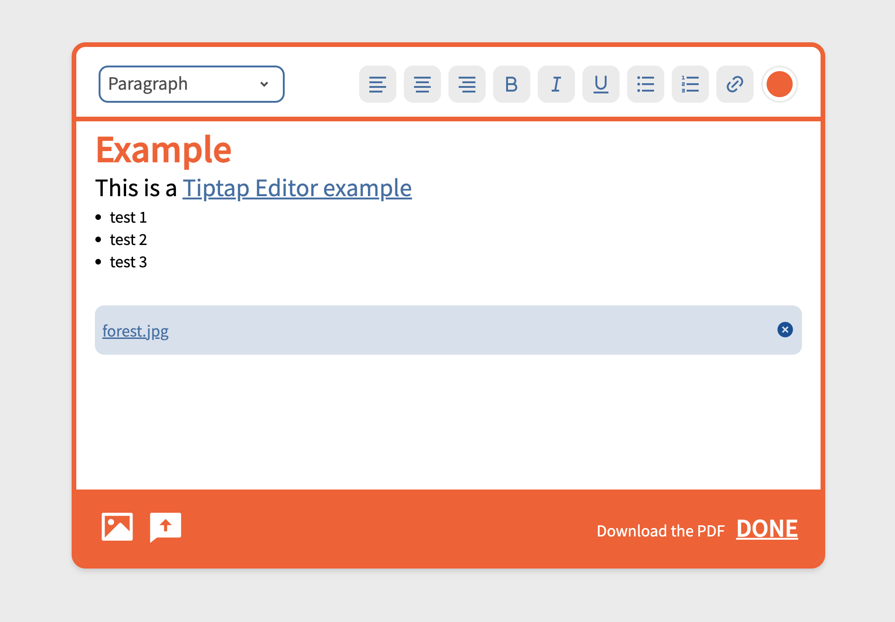
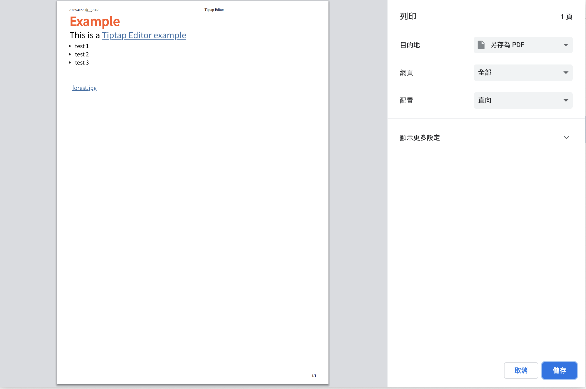

# Tiptap Editor By Javascript

This is a project use [Tiptap Editor](https://tiptap.dev/) to create a text editor with some of feature applied by Tiptap and some custom component. After create your article, you can download the PDF.

## Feature 🍊

- FontSize Extension

- TextAlign, Bold, Italic, Underline, BulletList, OrderedList

- ColorPicker

- Create links

- File Upload

- Image Upload

